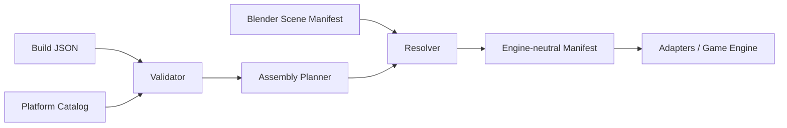

# BLACKMAMBA Weapon Assembly System

> **Una plataforma. Muchas configuraciones. Una sola lógica de ensamblaje.**

Framework paramétrico para ensamblar **objetos modulares ficticios de videojuego** mediante catálogos, sockets canónicos, descriptores JSON y escenas creadas en Blender.

El proyecto evita duplicar assets completos para cada variante. Una plataforma define contratos; los módulos se conectan a esos contratos; los datos describen la build; Blender aporta la representación visual; el runtime valida, planifica y resuelve el ensamblaje.

> [!IMPORTANT]
> El sistema modela apariencia, modularidad, animación e integración de gameplay. No reproduce mecanismos internos funcionales de armas reales.

```text
CORE + MODULES + COSMETICS + BUILD DATA = RESOLVED ASSET
```

## Problema que resuelve

Los pipelines tradicionales suelen copiar modelos completos para producir variantes. Eso multiplica meshes, materiales, escenas y lógica difícil de mantener.

BLACKMAMBA usa un asset canónico y una capa de datos para generar configuraciones reproducibles:

- una plataforma base;
- módulos intercambiables;
- sockets como contratos espaciales;
- validación antes de exportar;
- manifests neutrales al motor;
- adaptadores para distintos destinos.

## Arquitectura



La geometría no define la lógica de gameplay. La configuración vive en datos y la escena aporta transforms de sockets. Consulta [`docs/architecture.md`](docs/architecture.md) para los contratos, límites entre capas y estrategia de validación.

## Estado actual

**v0.1.0 — Parametric foundation**

El runtime ya incluye:

- validación de catálogos de plataforma;
- validación de builds JSON;
- inspección de módulos registrados;
- planificación determinista de ensamblaje;
- generación de manifests;
- validación de manifests de escena;
- resolución de builds contra transforms exportados desde Blender;
- validación de descriptores paramétricos;
- familia primitiva `box_body`.

## Quick Start

Requisitos:

- Python 3.11 o superior;
- Git;
- Blender para el pipeline visual y exportación de escenas.

```bash
git clone https://github.com/Blackmvmba88/weaponassambly.git
cd weaponassambly

python -m venv .venv
source .venv/bin/activate

python -m pip install --upgrade pip
python -m pip install -e ".[dev]"
```

En Windows PowerShell:

```powershell
.venv\Scripts\Activate.ps1
```

Validar el runtime:

```bash
bmwa --version
bmwa catalog-validate
pytest
```

Explorar una plataforma y validar una build:

```bash
bmwa inspect BM-S7
bmwa validate configs/bm-s7.example.json
bmwa plan configs/bm-s7.example.json
```

Consultar todos los comandos disponibles:

```bash
bmwa --help
```

## Flujo operativo

```text
Build JSON
    ↓
validate
    ↓
plan
    ↓
Blender scene manifest
    ↓
scene-validate
    ↓
resolve
    ↓
engine adapter / export
```

Ejemplo de resolución:

```bash
bmwa resolve \
  configs/bm-s7.example.json \
  examples/bm-s7.scene.json \
  --adapter generic-json \
  --output exports/bm-s7.resolved.json
```

## Plataforma inicial — BM-S7

```text
BM_SIDEARM_ROOT
│
├── CORE
│   ├── frame
│   ├── slide_shell
│   └── grip
│
├── TOP
│   ├── optic_mount
│   ├── red_dot
│   └── thermal_module
│
├── FRONT
│   └── cosmetic_front_module
│
├── BOTTOM
│   ├── rail
│   ├── light_module
│   └── sensor_module
│
├── MAG
│   ├── magazine_A
│   ├── magazine_B
│   └── coupler
│
└── COSMETICS
    ├── grip_panel
    ├── engraving
    ├── emblem
    └── skins
```

### Sockets canónicos

```text
SOCKET_TOP
SOCKET_BOTTOM
SOCKET_FRONT
SOCKET_MAG
SOCKET_GRIP
```

Cada módulo se conecta exclusivamente mediante su socket compatible. Los sockets forman parte del contrato estable entre catálogo, build, escena y runtime.

## Build data

Las configuraciones se describen como datos, no como modelos duplicados.

```json
{
  "platform": "BM-S7",
  "finish": "polished_black",
  "optic": "MAMBA_RD01",
  "bottom_module": "X_TAC",
  "mag_style": "dual",
  "grip": "serpent_scale",
  "engraving": "BLACKMAMBA"
}
```

Variantes futuras pueden reutilizar exactamente el mismo asset base:

```text
BM-S7 Phantom
BM-S7 Chrome
BM-S7 Viper
BM-S7 Nightfall
BM-S7 Royal
```

## Pipeline Blender

```text
blockout
→ silhouette
→ primary shapes
→ secondary shapes
→ modular split
→ materials
→ UV / bake
→ rig
→ assembly animation
→ LODs
→ scene manifest
→ game export
```

Colecciones propuestas:

```text
BLACKMAMBA_SIDEARM
├── BODY
├── OPTIC
├── SENSOR
├── MAGAZINES
├── DETAILS
└── RIG
```

### Animación de ensamblaje

Cada pieza intercambiable puede tener tres estados espaciales:

```text
assembly_start
assembly_approach
assembly_end
```

Timeline base:

```text
0f    exploded
20f   approach
28f   alignment
34f   lock
40f   completed
```

Esto permite construir exploded views, inspección individual, cámara cinematográfica y secuencias de montaje reproducibles.

## Lenguaje paramétrico

El proyecto está evolucionando de un caso visual específico hacia un lenguaje de objetos modulares. Un descriptor paramétrico define una familia, dimensiones y metadatos sin depender de coordenadas accidentales.

```bash
bmwa parametric-validate examples/parametric_box_body.json
```

La BM-S7 funciona como plataforma inicial y banco de pruebas del runtime, no como límite conceptual del sistema.

## Principios

1. **Contratos antes que coordenadas mágicas.**
2. **Un asset base, muchas builds.**
3. **Sockets antes que animaciones.**
4. **Datos antes que lógica visual.**
5. **Resultados deterministas y validables.**
6. **Diseño ficticio y no funcional.**
7. **Runtime desacoplado del motor de juego.**

## Estructura del repositorio

```text
weaponassambly/
├── .github/workflows/       # CI
├── configs/                 # Build configurations
├── docs/                    # Architecture and design notes
├── examples/                # Fixtures and manifests
├── schemas/                 # Data contracts
├── scripts/                 # Blender and validation tooling
├── src/weaponassambly/      # Runtime package
├── tests/                   # Automated tests
├── Makefile
└── pyproject.toml
```

## Roadmap

### Phase 0 — Foundation

- [x] Definir plataforma inicial BM-S7.
- [x] Definir jerarquía modular.
- [x] Definir sockets canónicos.
- [x] Definir catálogos y validadores iniciales.
- [x] Crear CLI del runtime.
- [ ] Crear escena `BM_Sidearm_MASTER.blend`.
- [ ] Crear blockout visual del CORE.

### Phase 1 — Modular Asset

- [ ] Separar TOP / FRONT / BOTTOM / MAG / COSMETICS.
- [ ] Validar origins y sockets desde Blender.
- [ ] Crear materiales BlackMamba base.
- [ ] Crear exploded view.

### Phase 2 — Assembly Runtime

- [x] Definir esquema de builds.
- [x] Crear validador de configuraciones.
- [x] Crear planner determinista.
- [x] Resolver builds contra manifests de escena.
- [ ] Crear animación de ensamblaje completa.
- [ ] Añadir adaptadores de motores de juego.

### Phase 3 — Parametric Object Platform

- [x] Introducir descriptores paramétricos.
- [x] Añadir familia `box_body`.
- [ ] Añadir más familias primitivas.
- [ ] Definir composición y constraints entre familias.
- [ ] Generar escenas y assets derivados.

### Phase 4 — Workshop

- [ ] Cámara orbital.
- [ ] Selección de módulos.
- [ ] Preview de skins.
- [ ] Estadísticas de gameplay desacopladas del mesh.
- [ ] Presets de builds.

## Desarrollo

```bash
ruff check .
pytest
```

También puedes utilizar los targets disponibles en el `Makefile` para ejecutar validaciones del pipeline.

## Documentación

- [`docs/architecture.md`](docs/architecture.md) — contratos y flujo del sistema.
- [`docs/parametric-object-language.md`](docs/parametric-object-language.md) — dirección del lenguaje paramétrico.
- [`docs/`](docs/) — decisiones y especificaciones adicionales.

## Licencia

MIT.

## TOKYO Phase III — COMPARE

Comparar dos certificados:

```bash
bmwa certify configs/bm-s7.example.json examples/bm-s7.scene.json -o expected.json
bmwa certify configs/bm-s7.example.json examples/bm-s7.scene.json -o actual.json
bmwa compare expected.json actual.json
```

La salida es `MATCH` (código de salida 0) cuando todos los campos coinciden.
Si cambia algún campo, devuelve `MISMATCH` (código 1), las versiones y las
diferencias en orden fijo con valores `expected` y `actual`. Un archivo ausente,
JSON inválido o certificado mal formado devuelve `ERROR` por stderr (código 2).
El orden de las claves y el formato del JSON no afectan la comparación.

Se requieren los siete campos del certificado, sin campos adicionales, versiones
enteras positivas, un conteo de módulos no negativo y un digest hexadecimal de
64 caracteres en minúsculas. Las versiones se comparan como datos: no se migra
entre versiones. COMPARE compara declaraciones del certificado; no recalcula el
build ni verifica autenticidad. Para comprobar un build, certifícalo de nuevo y
compara el resultado con el certificado guardado.

## TOKYO — EXPORT con certificado de referencia

```bash
bmwa certify configs/bm-s7.example.json examples/bm-s7.scene.json -o expected.json
bmwa export configs/bm-s7.example.json examples/bm-s7.scene.json \
  --expected expected.json --adapter generic-json -o exports/bm-s7.certified.json
```

EXPORT resuelve y certifica los inputs actuales, compara todos los campos con el
certificado de referencia y escribe únicamente cuando obtiene `MATCH`. El archivo
contiene `export_version: 1`, `certification` y `payload` (la salida del adaptador).
La salida es determinista para los mismos inputs y adaptador.

Un `MISMATCH` devuelve código 1 y no crea ni modifica el archivo de salida.
Un certificado de referencia inválido o un error de escritura devuelve código 2;
los errores de validación o resolución devuelven código 1 (un build ilegible, 2).
El certificado cubre el build resuelto; no es una firma de autenticidad ni un hash
del archivo exportado o de los campos añadidos por el adaptador. Conserva una
referencia previamente aprobada para verificar futuras construcciones.
