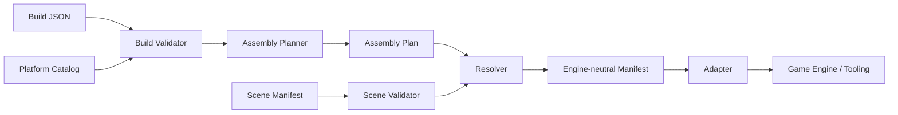

# Architecture

BLACKMAMBA Weapon Assembly System is a data-driven runtime for composing **fictional modular game assets**. The runtime owns validation and deterministic assembly logic; DCC tools and game engines are adapters around that core.

> The project models visual modularity, animation, metadata and game integration. It does not model or document functional real-world weapon mechanisms.

## Design goals

- Keep gameplay/configuration logic independent from Blender and any single engine.
- Treat sockets and schemas as stable contracts between tools.
- Produce deterministic output from the same catalog, build and scene data.
- Validate early so malformed assets fail before export or runtime integration.
- Reuse canonical assets instead of duplicating full variants.

## High-level flow



The important boundary is between **intent** and **representation**:

- the build describes what should be assembled;
- the catalog describes what is allowed;
- the planner turns validated intent into an ordered plan;
- the scene manifest supplies spatial transforms exported by a DCC tool;
- the resolver combines the plan with scene data;
- adapters translate the resolved manifest into a target-specific format.

## Core contracts

### Platform catalog

The platform catalog is the source of truth for a modular asset family. It defines stable identifiers, supported slots/sockets, registered modules and compatibility rules.

The catalog should remain engine-neutral. Engine paths, scene object names and renderer-specific metadata belong in adapters or scene manifests rather than in core compatibility rules.

### Build document

A build document is user- or tool-authored intent. It selects a platform and requests a set of compatible modules or cosmetic choices.

Build validation should answer only contract questions such as:

- does the platform exist;
- are referenced modules registered;
- are selected modules compatible with the requested slots;
- are required values present and correctly typed.

A valid build should not depend on Blender being installed or a particular scene being open.

### Assembly plan

The planner converts a validated build into a deterministic intermediate representation. The plan should contain stable identifiers and ordering, not DCC-specific transforms.

Determinism is important because the same inputs should produce the same plan. This makes tests, caching, debugging and export reproducibility much easier.

### Scene manifest

The scene manifest is the bridge from a DCC scene into the runtime. It carries the transforms and scene-side identifiers needed to resolve the planned modules.

This keeps Blender-specific concerns outside of the planner and validator. A future exporter from another DCC can emit the same manifest contract.

### Resolved manifest

The resolver combines a valid assembly plan with a valid scene manifest and produces an engine-neutral resolved asset description.

The resolved manifest is the preferred integration boundary for downstream tooling. Engine adapters should consume this object instead of reaching back into the build, catalog or Blender scene directly.

## Layering

```text
schemas / data contracts
        ↓
catalog + build validation
        ↓
assembly planner
        ↓
scene validation
        ↓
resolver
        ↓
adapters
        ↓
engine / tooling integration
```

Dependencies should generally point downward in this diagram. In particular:

- validators should not import engine adapters;
- the planner should not depend on Blender APIs;
- the resolver should consume serialized scene data rather than live scene state;
- adapters may depend on resolved-manifest types, but core logic should not depend on adapters.

## Failure model

Prefer explicit validation errors at layer boundaries instead of allowing invalid data to travel deeper into the pipeline.

A useful rule is:

```text
parse → validate → normalize → plan → resolve → adapt
```

Each stage should either return a well-defined value or fail with a message that identifies the contract that was violated.

## Determinism

Deterministic behavior should be preserved by:

- sorting or otherwise defining iteration order where serialized output is produced;
- avoiding implicit dependence on filesystem ordering;
- using stable identifiers instead of scene traversal order;
- keeping normalization rules explicit;
- testing representative inputs against expected manifests.

## CLI as an integration surface

The `bmwa` CLI is both a developer tool and an executable specification of the pipeline. The current command flow is:

```text
catalog-validate
inspect
validate
plan
scene-validate
resolve
parametric-validate
```

Commands should remain thin wrappers around reusable Python functions so tests and future UI/tool integrations can call the same core logic without shelling out.

## Testing strategy

The most valuable tests are contract-focused:

- valid and invalid catalog fixtures;
- valid and invalid build fixtures;
- deterministic planner output;
- scene-manifest validation;
- resolver output for known fixtures;
- adapter serialization;
- CLI smoke tests for documented examples.

CI should exercise the same example files shown in the README so documentation and executable behavior do not drift apart.

## Extension points

The architecture is intended to grow in a few directions without changing the core boundaries:

- additional modular asset families;
- additional parametric primitive families;
- new DCC exporters that emit the scene-manifest contract;
- new engine adapters that consume the resolved manifest;
- richer constraints and metadata at the schema layer.

When adding a feature, prefer extending a contract or adding a new adapter over introducing a direct dependency from core runtime code to a specific DCC or engine.
